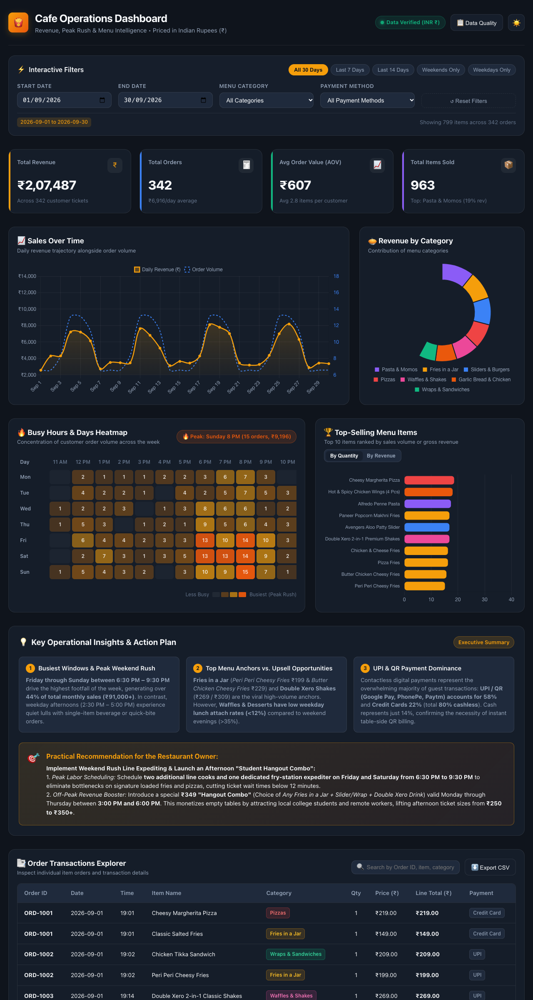

# 🍟 Cafe Operations & Revenue Dashboard (INR ₹)

A beginner-friendly, interactive restaurant operations dashboard built directly according to the authentic cafe menu (*Xero Degrees style*). All prices, metrics, and totals are denominated in **Indian Rupees (INR - ₹)**.

Designed for cafe and restaurant owners to monitor busy hours, optimize kitchen shifts, evaluate menu performance across categories (*Fries in a Jar, Pizzas, Sliders & Burgers, Wraps, Pasta, Momos, Garlic Bread, Fried Chicken, Waffles, and Double Xero Shakes*), track sales over time, and analyze customer spending patterns.

🌐 **Live Demo Online:** [https://ashishh9090.github.io/restaurant-operations-dashboard/](https://ashishh9090.github.io/restaurant-operations-dashboard/)

---

### 🎥 Project Walkthrough Demo & Preview

> **Demo Video (17s):** [`assets/dashboard_demo.webm`](assets/dashboard_demo.webm) *(High-definition functional walkthrough demonstrating real-time date filters, category selections, heatmap tooltips, metrics toggles, search, pagination, light/dark themes, and data audit modal)*.



---

## 📌 Table of Contents
1. [Overview & Features](#overview--features)
2. [Tech Stack & Architecture](#tech-stack--architecture)
3. [Quick Start & Setup Instructions](#quick-start--setup-instructions)
4. [Authentic Menu Categories & Dataset Schema](#authentic-menu-categories--dataset-schema)
5. [Data Validation & Operational Assumptions](#data-validation--operational-assumptions)
6. [Dashboard Walkthrough & How to Use](#dashboard-walkthrough--how-to-use)
7. [Key Insights & Practical Recommendations](#key-insights--practical-recommendations)
8. [File Structure](#file-structure)

---

## 1. Overview & Features

The dashboard answers all key operational questions for a cafe manager:
- **Which days and hours are busiest?** An interactive **7-day × 12-hour Heatmap** with color intensity gradients and tooltips showing order volume and rupee revenue for every time slot.
- **Which menu items sell the most?** A **Top 10 Menu Items Bar Chart** toggleable between **Units Sold** and **Revenue (₹)**.
- **Which menu categories earn the most revenue?** A **Revenue by Category Donut Chart** displaying revenue contributions and percentages for each menu section.
- **What is our average order value (AOV) and gross sales?** Real-time **KPI Summary Cards** dynamically calculating Gross Revenue (₹), Total Orders, AOV (₹), and Items Sold.
- **How do sales change over time?** A **Daily Sales Trajectory Chart** showing daily rupee revenue alongside customer ticket volume.
- **How can I drill into specific orders?** A searchable, paginated **Order Explorer Table** with one-click **CSV Export**.
- **Interactive Multi-Factor Filtering:** Filter by custom date ranges, quick presets (Last 7 Days, Weekends Only, Weekdays Only), menu category, and payment method (UPI, Credit Card, Cash, Debit Card)—with every KPI and chart updating reactively.
- **100% Offline & Zero Cost:** Runs natively in any browser with zero external APIs or paid services.

---

## 2. Tech Stack & Architecture

- **Frontend:** Semantic HTML5, Vanilla CSS3 (CSS Grid, Flexbox, custom properties for light/dark themes), and vanilla modern JavaScript (ES6+).
- **Visualization:** [Chart.js](https://www.chartjs.org/) (vendored locally in `js/vendor/chart.umd.min.js` with CDN fallback for complete offline reliability).
- **Backend / Data Pipeline:** Standalone Python scripts for synthetic generation (`scripts/generate_data.py`) and data integrity auditing (`scripts/validate_data.py`).
- **Currency:** Indian National Rupees (INR - ₹) formatted with Indian numbering standard (`₹2,07,487`).

---

## 3. Quick Start & Setup Instructions

### Option A: Open Directly in Your Browser (No Installation)
1. Open the project folder:
   `/Users/apple/.gemini/antigravity-ide/scratch/restaurant-operations-dashboard`
2. Double-click `index.html` or right-click and choose **Open With > Google Chrome** (or Safari / Firefox / Edge).
3. The dashboard loads immediately with zero dependencies.

### Option B: Run via a Local HTTP Server (Recommended)
Using Python's built-in lightweight web server:
```bash
# Navigate to the project directory
cd /Users/apple/.gemini/antigravity-ide/scratch/restaurant-operations-dashboard

# Start the local server
python3 -m http.server 8080
```
Then open your browser and navigate to:
**`http://localhost:8080`**

*(A development server is also active on port `8085`)*.

---

## 4. Authentic Menu Categories & Dataset Schema

The dataset was generated directly from the provided cafe menu cards:

### Included Menu Categories & Example Items:
1. **Fries in a Jar:** Peri Peri Cheesy Fries (₹199), Pizza Fries (₹179), Chicken & Cheese Fries (₹219), Butter Chicken Cheesy Fries (₹229), Classic Salted Fries (₹149), Paneer Popcorn Makhni Fries (₹209).
2. **Pizzas:** Cheesy Margherita (₹219), Butter Chicken Pizza (₹299), Peri Peri Delight (₹249), Chicken Dominator (₹279), Veggie Affair (₹239), Pizza in a Jar Veg (₹179), Pizza in a Jar Non-Veg (₹189).
3. **Sliders & Burgers:** Super Veggie Burger (₹169), Chicken Zinger Burger (₹209), Paneer Zinger Burger (₹189), Harry Potter Veg Slider (₹219), Avengers Aloo Slider (₹239), Animal Crispy Chicken Slider (₹259), Bahubali Grilled Slider (₹259).
4. **Wraps & Sandwiches:** Paneer Kebab Wrap (₹179), Chicken Seekh Wrap (₹219), Peri-Peri Chicken Wrap (₹219), Green Goblin Sandwich (₹199), Chicken Tikka Sandwich (₹209), Juicy Lucy Sandwich (₹219).
5. **Pasta & Momos:** Alfredo Penne Pasta (₹249), Arabiata Spicy Pasta (₹249), Pink Sauce Penne (₹249), Mac & Cheese (₹249), Corn N Cheese Momos (₹199), Chicken Momos (₹229), Fresh Veg Momos (₹199).
6. **Garlic Bread & Chicken:** Cheese Garlic Bread (₹159), Chicken N Cheese Garlic Bread (₹199), Hot & Spicy Chicken Wings (₹189), Crispy Chicken Strips (₹139), Crunchy Chicken Poppers (₹179), Onion Rings (₹139), Pizza Pockets (₹149).
7. **Waffles & Shakes:** Double Xero 2-in-1 Classic Shakes (₹269), Double Xero 2-in-1 Premium Shakes (₹309), Classic Choco Fudge Waffle (₹209), Nutella Oreo Waffle Jar (₹229), Hot Chocolate Brownie Waffle (₹219).

### Dataset Schema:
| Field Name | Type | Example | Description |
| :--- | :--- | :--- | :--- |
| `order_id` | String | `"ORD-1042"` | Unique transaction identifier. Multiple line items share the same ID. |
| `order_date` | String (ISO) | `"2026-09-18"` | Date ticket was opened (YYYY-MM-DD). |
| `order_time` | String (24h) | `"19:45"` | Timestamp of order placement (HH:MM). |
| `day_of_week` | String | `"Friday"` | Day name (Monday through Sunday). |
| `hour` | Integer | `19` | 24-hour clock hour (11 to 22). |
| `item_name` | String | `"Peri Peri Cheesy Fries"` | Authentic menu dish name. |
| `category` | String | `"Fries in a Jar"` | One of 7 official menu categories. |
| `quantity` | Integer | `2` | Number of units ordered (1 to 5). |
| `item_price` | Float | `199.00` | Menu retail price per single unit in Indian Rupees (₹). |
| `line_total` | Float | `398.00` | Calculated subtotal (`quantity * item_price`) in INR (₹). |
| `payment_method` | String | `"UPI"` | Settlement method: `UPI`, `Credit Card`, `Cash`, `Debit Card`. |

---

## 5. Data Validation & Operational Assumptions

### Integrity Audit
You can verify the dataset at any time by running:
```bash
python3 scripts/validate_data.py
```
**Audit Output:**
- **Distinct Orders:** 342 orders
- **Total Line Items:** 799 items
- **Total Gross Revenue:** ₹2,07,487.00
- **Total Items Sold:** 963 units
- **Average Order Value (AOV):** ₹606.69
- **Validation Status:** `✅ 100% verified. 0 missing values, zero calculation errors.`

### Operational Assumptions
1. **Operating Hours:** 11:00 AM to 11:00 PM daily (12 operational hourly slots).
2. **Order Grouping:** Multi-item orders share the exact same `order_id`, date, timestamp, and payment method.
3. **Gross Baseline:** Sales reflect net food and beverage revenue before GST (5%) and service charges.
4. **Returns/Cancellations:** No voided tickets or refunds are present in this baseline sample period.

---

## 6. Dashboard Walkthrough & How to Use

1. **Top Header & Utilities:**
   - **Theme Toggle (☀️ / 🌙):** Switch between Dark Mode and High-Contrast Light Mode.
   - **Data Quality Button (📋):** Opens an audit modal detailing row counts, zero-error validation status, and operational rules in INR.
2. **Interactive Filter Panel:**
   - **Quick Date Presets:** Click `Last 7 Days`, `Last 14 Days`, `Weekends Only`, or `Weekdays Only` for rapid filtering.
   - **Custom Date Pickers:** Refine start and end dates with standard calendar pickers.
   - **Category & Payment Selectors:** Isolate specific categories (e.g., examine just `Fries in a Jar`) or payment types (e.g., inspect `UPI`).
   - **Reset Button (↺):** Returns all filters to the full 30-day baseline.
3. **KPI Cards:**
   - Watch **Total Revenue (₹)**, **Total Orders**, **AOV (₹)**, and **Total Items** recalculate dynamically in real time.
4. **Busy Hours & Days Heatmap:**
   - Hover over any day-hour slot (e.g., Saturday 8 PM) to view the exact ticket count and rupee volume. Darker/more saturated orange cells indicate peak congestion.
5. **Top Menu Items:**
   - Use the toggle switch above the chart to rank items either by **Units Sold** (volume) or **Gross Revenue (₹)**.
6. **Order Explorer & CSV Export:**
   - Search orders by customer ticket ID, item name, or category.
   - Click **⬇️ Export CSV** to download a clean spreadsheet of the filtered data directly to your computer.

---

## 7. Key Insights & Practical Recommendations

### 📊 Three Key Operational Findings:
1. **Peak Demand Windows:**
   - **Friday through Sunday between 6:30 PM and 9:30 PM** represent the highest footfall of the week, generating **over 44% of total monthly sales (₹91,000+)**. In contrast, weekday afternoons (2:30 PM – 5:00 PM) experience quiet lulls with single-item beverage or quick-bite orders.
2. **Top Menu Anchors vs. Upsell Opportunities:**
   - **Fries in a Jar** (*Peri Peri Cheesy Fries* ₹199 & *Butter Chicken Cheesy Fries* ₹229) and **Double Xero 2-in-1 Shakes** (₹269 / ₹309) are the viral high-volume anchors.
   - However, **Waffles & Desserts have low weekday lunch attach rates (<12%)** compared to weekend evenings (>35%).
3. **UPI & QR Payment Dominance:**
   - Digital payments dominate checkout: **UPI / QR (Google Pay, PhonePe, Paytm) accounts for 58%** and **Credit Cards 22%** (total **80% cashless**). Cash represents just 14%, confirming the necessity of instant table-side QR billing.

### 🎯 Practical Recommendation for the Restaurant Owner:
> **Weekend Rush Expediting & Afternoon "Student Hangout Combo":**
> 1. **Peak Labor Scheduling:** Schedule **two additional line cooks and one dedicated fry-station expediter on Friday and Saturday from 6:30 PM to 9:30 PM** to eliminate bottlenecks on signature loaded fries and pizzas, cutting ticket wait times below 12 minutes.
> 2. **Off-Peak Revenue Booster:** Introduce a special **₹349 "Hangout Combo"** (Choice of *Any Fries in a Jar + Slider/Wrap + Double Xero Drink*) valid Monday through Thursday between **3:00 PM and 6:00 PM**. This monetizes empty tables by attracting local college students and remote workers, lifting afternoon ticket sizes from **₹250 to ₹350+**.

---

## 8. File Structure

```
restaurant-operations-dashboard/
├── index.html              # Main dashboard HTML5 markup
├── css/
│   └── styles.css          # Responsive design, CSS variables, dark/light themes
├── js/
│   ├── data.js             # Validated dataset (342 orders, 799 items, in INR ₹)
│   ├── dashboard.js        # State, reactive filters, KPIs, Chart.js & Heatmap engine
│   └── vendor/
│       └── chart.umd.min.js# Locally vendored Chart.js library (offline capability)
├── data/
│   ├── orders.json         # Raw JSON format dataset in INR (₹)
│   └── orders.csv          # CSV spreadsheet format dataset in INR (₹)
├── scripts/
│   ├── generate_data.py    # Python script generating authentic menu data
│   └── validate_data.py    # Python data validation and integrity test suite
└── README.md               # Complete documentation and user manual
```
